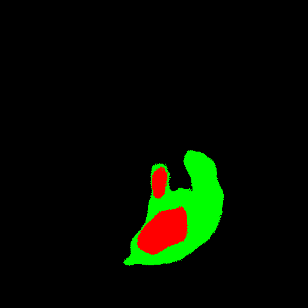

<h2>TensorFlow-FlexUNet-Image-Segmentation-Core-Penumbra-Acute-Ischemic-Stroke-NCCT (2025/09/25)</h2>
Toshiyuki Arai 
Software Laboratory antillia.com  
This is the first experiment of Image Segmentation for CPAISD (Core-Penumbra Acute Ischemic Stroke Dataset) Non Contrast Cranial CT, based on 
our <a href="./src/TensorFlowFlexUNet.py">TensorFlowFlexUNet</a>
 (<b>TensorFlow Flexible UNet Image Segmentation Model for Multiclass</b>)
 and a 512x512 pixels 
<a href="https://drive.google.com/file/d/14MtRxPujs3vRBh7M2VsV7aZj9-MsZNRg/view?usp=sharing">CPAISD-PNG-ImageMask-Subset.zip</a>
with colorized masks (Core:red, Penumbra:green), which was derived by us from <b>train</b> subset of 
<a href="https://zenodo.org/records/10892316">
<b>CPAISD: Core-Penumbra Acute Ischemic Stroke Dataset</b></a>
 
 
On singleclass segmentation for Ischaemic-Stroke-NCCT, please refer to our expriment 
<a href="https://github.com/sarah-antillia/TensorFlow-FlexUNet-Image-Segmentation-Automated-Ischaemic-Stroke-NCCT">TensorFlow-FlexUNet-Image-Segmentation-Automated-Ischaemic-Stroke-NCCT</a>
 
 

<b>Actual Image Segmentation for Images of 512x512 pixels</b> 
As shown below, the inferred masks predicted by our segmentation model trained on the 
our dataset appear similar to the ground truth masks, but they lack precision in certain areas. 
<b>rgb_map (Core:red, Penumbra:green)</b> 
<table>
<tr>
<th>Input: image</th>
<th>Mask (ground_truth)</th>
<th>Prediction: inferred_mask</th>
</tr>
<tr>
<td></td>
<td></td>
<td></td>
</tr>

<tr>
<td></td>
<td></td>
<td></td>
</tr>

<tr>
<td></td>
<td></td>
<td></td>
</tr>
</table>

 

<h3>1. Dataset Citation</h3>
The dataset used here was obtained from 
  
<a href="https://zenodo.org/records/10892316">
<b>CPAISD: Core-Penumbra Acute Ischemic Stroke Dataset</b></a>
 
 
<b>About Dataset</b> 
The Core-Penumbra Acute Ischemic Stroke Dataset (CPAISD) provides 112 
anonymized CT scans from hyperacute stroke patients.   
<b>Experts have manually delineated the ischemic core and penumbra on every relevant slice.</b>  
Anonymized with Kitware DicomAnonymizer, it retains key DICOM fields for demographic and domain shift studies:
 
 
The dataset is split into three folds for robust research:
 
Training: 92 studies, 8,376 slices 
Validation: 10 studies, 980 slices 
Testing: 10 studies, 809 slices  
 
DOI: <a href="https://doi.org/10.5281/zenodo.10892316">https://doi.org/10.5281/zenodo.10892316</a>
  

<b>Citation:</b> 
Umerenkov, D., Kudin, S., Peksheva, M., & Pavlov, D. (2024). CPAISD: Core-Penumbra Acute Ischemic Stroke Dataset [Data set]. 
 Zenodo. https://doi.org/10.5281/zenodo.10892316  
 

<b>License:</b>  
<a href="https://creativecommons.org/licenses/by/4.0/legalcode">
Creative Commons Attribution 4.0 International</a>
 
 
<h3>
<a id="2">
2 CPAISD ImageMask Dataset
</a>
</h3>
<h4>2.1 Download CPAISD-PNG-ImageMask-Subset</h4>
 If you would like to train this CPAISD Segmentation model by yourself,
 please download  our dataset <a href="https://drive.google.com/file/d/14MtRxPujs3vRBh7M2VsV7aZj9-MsZNRg/view?usp=sharing">CPAISD-PNG-ImageMask-Subset.zip</a> on the google drive
, expand the downloaded and put it under <b>./dataset</b> folder to be. 
<pre>
./dataset
└─CPAISD
    ├─test
    │   ├─images
    │   └─masks
    ├─train
    │   ├─images
    │   └─masks
    └─valid
        ├─images
        └─masks
</pre>
 
<b>CPAISD Statistics</b> 
 
 
As shown above, the number of images of train and valid datasets is not so large to use for a training set of our segmentation model.
 
 
<h4>2.2 PNG Subset Generation </h4>
For simplity and reducing a training time, we generated our dataset with colorized masks from the <i>image.npz</i> and <i>mask.npz</i> 
files in <b>train</b> subset only in the following original CPAISD dataset.
 
 
<b>CPAISD Dataset Structure</b> 
<pre>
./dataset
├─test
│  ├─2.25.116613827163187469445304378258728959191
│  │  ├─00000
             ├─image.npz
             └─mask.npz
...
├─train
│  ├─2.25.10536893979831470310119796877031918393
│  │  ├─00000
             ├─image.npz
             └─mask.npz
...
└─val
    ├─2.25.127914288592697535538245879784450329006
    │  ├─00000
             ├─image.npz
             └─mask.npz
</pre>
<b>2.3 Exclusion and Colorization of Masks </b> 
<ul>
<li>We excluded all black empty masks and their corresponding images,
 which were irrelevant for training our segmentation model, from the original dataset,</li>
<li>We generated colorized masks (Core:red, Penumbra:green) from the <i>mask.npz</i> files.
</li>
</ul>
This time, we used the original <i>image.npz</i> files to generate the dataset without any enhancement. 
However, you can also try to generate normalized images from them, which are more recognizable to the human eye as shown below.
This will cause some pixel-level changes in the original images, which might be harmful to build a better segmentation model. 
<table>
<tr>
<th>Original image</th>
<th>Normalized image</th>
<th>Ground Truth</th>
</tr>
<tr>
<td></td>
<td></td>
<td></td>

<tr>
</table>

 
<h4>2.4 PNG Dataset Images and Masks </h4>

<b>Train_images_sample</b> 

 
<b>Train_masks_sample</b> 

 

<h3>
3 Train TensorFlowUNet Model
</h3>
 We have trained CPAISD TensorFlowFlexUNet Model by using the following
<a href="./projects/TensorFlowFlexUNet/CPAISD/train_eval_infer.config"> <b>train_eval_infer.config</b></a> file.  
Please move to ./projects/TensorFlowFlexUNet/CPAISDand run the following bat file. 
<pre>
>1.train.bat
</pre>
, which simply runs the following command. 
<pre>
>python ../../../src/TensorFlowFlexUNetTrainer.py ./train_eval_infer.config
</pre>

<b>Model parameters</b> 
Defined a small base_filters=16 and large base_kernels=(9,9) for the first Conv Layer of Encoder Block of 
<a href="./src/TensorFlowFlexUNet.py">TensorFlowFlexUNet.py</a> 
and a large num_layers (including a bridge between Encoder and Decoder Blocks).
<pre>
[model]
image_width    = 512
image_height   = 512
image_channels = 3

num_classes    = 3

base_filters   = 16
base_kernels   = (9,9)
num_layers     = 8
dropout_rate   = 0.04
dilation       = (1,1)

</pre>

<b>Learning rate</b> 
Defined a small learning rate.  
<pre>
[model]
learning_rate  = 0.00007
</pre>

<b>Online augmentation</b> 
Disabled our online augmentation.  
<pre>
[model]
model         = "TensorFlowFlexUNet"
generator     = False
</pre>

<b>Loss and metrics functions</b> 
Specified "categorical_crossentropy" and <a href="./src/dice_coef_multiclass.py">"dice_coef_multiclass"</a>. 
<pre>
[model]
loss           = "categorical_crossentropy"
metrics        = ["dice_coef_multiclass"]
</pre>
<b>Learning rate reducer callback</b> 
Enabled learning_rate_reducer callback, and a small reducer_patience.
<pre> 
[train]
learning_rate_reducer = True
reducer_factor     = 0.5
reducer_patience   = 4
</pre>

<b>Early stopping callback</b> 
Enabled early stopping callback with patience parameter.
<pre>
[train]
patience      = 10
</pre>

<b>RGB Color map</b> 
rgb color map dict for CPAISD 1+2 classes.
<pre>
[mask]
mask_datatype    = "categorized"
mask_file_format = ".png"

;CPAISD rgb color map dict for 3 classes.
;   Background:black, Penumbra:green, Stroke Core:red
rgb_map = {(0,0,0):0,(0,255,0):1, (255,0,0):2}

</pre>

<b>Epoch change inference callback</b> 
Enabled <a href="./src/EpochChangeInferencer.py">epoch_change_infer callback (EpochChangeInferencer.py)</a></b>. 
<pre>
[train]
epoch_change_infer       = True
epoch_change_infer_dir   =  "./epoch_change_infer"
num_infer_images         = 6
</pre>

By using this callback, on every epoch_change, the inference procedure can be called
 for 6 images in <b>mini_test</b> folder. This will help you confirm how the predicted mask changes 
 at each epoch during your training process.    

<b>Epoch_change_inference output at starting (epoch 1,2,3)</b> 
 
 
<b>Epoch_change_inference output at middlepoint (epoch 34,35 36)</b> 
 
 

<b>Epoch_change_inference output at ending (epoch 70,71,72)</b> 
 
 

In this experiment, the training process was stopped at epoch 72 by EarlyStopping Callback.  
 
 

<a href="./projects/TensorFlowFlexUNet/CPAISD/eval/train_metrics.csv">train_metrics.csv</a> 
 

 
<a href="./projects/TensorFlowFlexUNet/CPAISD/eval/train_losses.csv">train_losses.csv</a> 
 

 

<h3>
4 Evaluation
</h3>
Please move to a <b>./projects/TensorFlowFlexUNet/CPAISD</b> folder, 
and run the following bat file to evaluate TensorFlowUNet model for CPAISD. 
<pre>
./2.evaluate.bat
</pre>
This bat file simply runs the following command.
<pre>
python ../../../src/TensorFlowFlexUNetEvaluator.py ./train_eval_infer.config
</pre>

Evaluation console output: 

  Image-Segmentation-CPAISD

<a href="./projects/TensorFlowFlexUNet/CPAISD/evaluation.csv">evaluation.csv</a> 

The loss (categorical_crossentropy) to this CPAISD/test was not so low, but dice_coef_multiclass high as shown below.
 
<pre>
categorical_crossentropy,0.0473
dice_coef_multiclass,0.9757
</pre>
 
<h3>
5 Inference
</h3>
Please move to a <b>./projects/TensorFlowFlexUNet/CPAISD</b> folder 
,and run the following bat file to infer segmentation regions for images by the Trained-TensorFlowUNet model for CPAISD. 
<pre>
./3.infer.bat
</pre>
This simply runs the following command.
<pre>
python ../../../src/TensorFlowFlexUNetInferencer.py ./train_eval_infer.config
</pre>

<b>mini_test_images</b> 
 
<b>mini_test_mask(ground_truth)</b> 
 

<b>Inferred test masks</b> 
As shown below, this segmentation model failed to detect some Ischemia lesions. 

 
 

<b>Enlarged images and masks </b> 

<table>
<tr>
<th>Image</th>
<th>Mask (ground_truth)</th>
<th>Inferred-mask</th>
</tr>

<tr>
<td></td>
<td></td>
<td></td>
</tr>

<tr>
<td></td>
<td></td>
<td></td>
</tr>

<tr>
<td></td>
<td></td>
<td></td>
</tr>
<tr>
<td></td>
<td></td>
<td></td>
</tr>
<tr>
<td></td>
<td></td>
<td></td>
</tr>
<tr>
<td></td>
<td></td>
<td></td>
</tr>

</table>

 

<h3>
References
</h3>
<b>1. Automated Segmentation of Ischemic Stroke Lesions in Non-Contrast Computed Tomography Images for Enhanced Treatment and Prognosis</b> 
Toufiq Musah, Prince Ebenezer Adjei, Kojo Obed Otoo 

<a href="https://arxiv.org/html/2411.09402">
https://arxiv.org/html/2411.09402
</a>
 
 
<b>2. APIS: a paired CT-MRI dataset for ischemic stroke segmentation - methods and challenges </b> 
Santiago Gómez, Edgar Rangel, Daniel Mantilla, Andrés Ortiz, Paul Camacho, Ezequiel de la Rosa, Joaquin Seia,  
Jan S. Kirschke, Yihao Li, Mostafa El Habib Daho & Fabio Martínez 
<a href="https://www.nature.com/articles/s41598-024-71273-x">
https://www.nature.com/articles/s41598-024-71273-x
</a>
 
 
<b>3.Core-Penumbra Hyperacute Ischemic Stroke Dataset </b> 
D. Umerenkov, S. Kudin, M. Peksheva & D. Pavlov 
<a href="https://www.nature.com/articles/s41597-025-05000-0">
https://www.nature.com/articles/s41597-025-05000-0</a>
 
 
<b>4.Segmenting Ischemic Penumbra and Infarct Core Simultaneously on  
Non-Contrast CT of Patients with Acute Ischemic Stroke Using Novel Convolutional Neural Network</b> 
Hulin Kuang, Xianzhen Tan, Jie Wang, Zhe Qu, Yuxin Ca, Qiong Chen, Beom Joon Kim, and Wu Qiu 
<a href="https://www.mdpi.com/2227-9059/12/3/580">
https://www.mdpi.com/2227-9059/12/3/580
</a>
 
<a href=" https://doi.org/10.3390/biomedicines12030580">https://doi.org/10.3390/biomedicines12030580</a>
 
 
<b>5.TensorFlow-FlexUNet-Image-Segmentation-Automated-Ischaemic-Stroke-NCCT</b> 
Toshiyuki Arai antillia.com 
<a href="https://github.com/sarah-antillia/TensorFlow-FlexUNet-Image-Segmentation-Automated-Ischaemic-Stroke-NCCT">
https://github.com/sarah-antillia/TensorFlow-FlexUNet-Image-Segmentation-Automated-Ischaemic-Stroke-NCCT</a>

